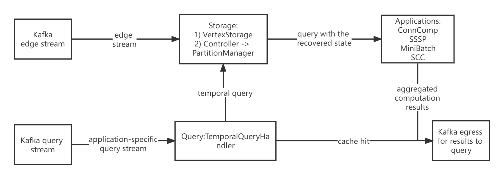
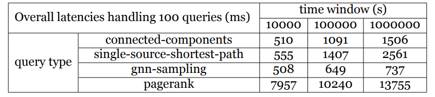
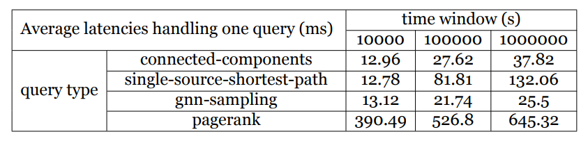

# hesse

A temporal graph library based on Flink Stateful Functions

## Features

This project aims to build an event-driven distributed temporal graph analytics library on top of [Flink Stateful Functions](https://nightlies.apache.org/flink/flink-statefun-docs-stable/).
It provides efficient storage of temporal graphs and supports different types of concurrent queries on different graph algorithms in arbitrary event-time windows.
The support of arbitrary event-time window query means that Hesse will recover the graph state by applying all the activities in the event-time window for temporal queries of different applications.

## Architecture

The core architecture is divided into the Ingress, the storage, query, coordination, application layers, and the Egress.
Flink Stateful Functions guarantee that each Function has its own context and communicates with each other by message passing.
Therefore, Hesse is to some extent a group of event-driven functions.
They provide powerful functionalities and flexibility in the FaaS way.
Currently, the Kafka ingress and egress are used. The containers are built and run in the Docker environment.

The basic architecture is shown as follows:



## How to use

There are different scenarios so far you can try out, I write a simple [script](scripts/scenarios_config.py) to help you select the right scenario.
For developers, you can write your own `docker-compose.yml` and `module.yaml` to add your services or scenarios.

```
python scripts/scenarios_config.py
```

build the environment and start the containers

```shell
docker-compose down
docker-compose build
docker-compose up
```

Currently, five algorithms are implemented for queries, Connected Component algorithm, Strongly Connected Component algorithm,
GNNSampling algorithm, Single Source Shortest Path algorithm, and PageRank algorithm.
Make sure to select the right ingress file and type using `scripts/scenarios_config.py`.

To see the results of a query, you can execute the following command:

```shell
docker-compose exec kafka kafka-console-consumer --bootstrap-server kafka:9092 --topic query-results --partition 0 --from-beginning --property print.key=true --property key.separator=" ** "
```

Notice that you should set a reasonable delay starting time for the query producer image using the config script based on how large your dataset is
because you may want to see correct results after your graph is fully established.

Another way (**highly recommended**) is to decouple the whole `docker-compose up` into three stages: 1) edge producing, 2) edge storage 3) query producing and processing
by using the following commands:

```shell
docker-compose down
docker-compose build
# open the benchmarks subscriber beforehand
docker-compose up -d hesse-benchmarks
# do edge producing, and you can check topic temporal-graph
# to see whether your dataset is fully pushed into topic
docker-compose up -d hesse-graph-producer
# hesse, statefun worker and statefun manager will store
# the edges into RocksDB state backend
docker-compose up -d statefun-worker
# do query producing, and hesse will handle these queries
# and show the results in topic query-results
docker-compose up -d hesse-query-producer
```

Apart from the graph datasets and query stream that users can configure by editing the `docker-compose.yml`,
users can configure other system parameters by editing `hesse.properties` and `log4j2.properties` in the `resources` folder.

## Demo

This [demo](doc/demo.md) gives an example demo to start with the project.

## Applications

Here are some examples of queries, and the corresponding JSON query strings as streaming ingress:

* What is the connected component id of vertex 151 between time 0 and 400000 and all the vertex ids in the same connected component?

```json
{"query_id": "1", "user_id": "1", "vertex_id": "151", "query_type": "connected-components", "start_t": "0", "end_t":"400000"}
```

* What is the single source shortest path from vertex 151 to the other approachable vertexes and the path distance between time 0 and 400000?

```json
{"query_id": "2", "user_id": "1", "vertex_id": "151", "query_type": "single-source-shortest-path", "start_t": "0", "end_t":"400000"}
```

* What is the neighbourhood spanning from (Breadth-First search) vertex 151 with hop size 2 and sample size 2 between time 0 and 400000?

```json
{"query_id": "3", "user_id": "1", "vertex_id": "151", "query_type": "gnn-sampling", "start_t": "0", "end_t":"400000", "parameter_map": {"h": "2", "k": "2"}}
```

* What is the PageRank value in 10 iterations of all the vertexes between time 0 and 150?

```json
{"query_id": "4", "user_id": "1", "vertex_id": "all", "query_type": "pagerank", "start_t": "0", "end_t":"150", "parameter_map": {"iterations":"10"}}
```

Hesse even allows you to put these different types of queries with different parameters into one file to feed into the query stream.
For more examples, see the `datasets/query` folder.

## Storage paradigms

Hesse offers four kinds of configurable [storage paradigms](https://github.com/Spycsh/hesse/blob/main/src/main/resources/hesse.properties),
and can be configured based on users' graph stream for better performance. We recommend you configure storage paradigm as `TM` and `iTM` and specify appropriate bucket number if you want to do analytics on large-scale graph. Details will be demonstrated in future paper to this repository.

<!-- ## Benchmarking

Graph Stream Dataset: refer to [link](https://snap.stanford.edu/data/email-Eu-core-temporal.html)

Query Stream (synthetic): refer to [link](https://github.com/Spycsh/hesse/blob/main/datasets/query/generate_synthetic_queries.py)

Storage Paradigm: iTM with bucket number 128

*  Overall latencies in **milliseconds** handling 100 concurrent queries given
   different query types and time windows



* Average latencies in **milliseconds** handling one query given different query
  types and time windows

 -->

## Advanced Tips

These are still in experiments and tips for developers

* inspect the topics

```
docker-compose exec kafka kafka-console-consumer --bootstrap-server kafka:9092 --topic <replace topic name here> --from-beginning
```

Here are the exposed topics:

|topic name|usage|io form|
|---|---|---|
|temporal-graph|graph ingress stream|ingress|
|query|query stream|ingress|
|query-results|results of queries|egress|
|storage-time|time of storage used for benchmarking|egress|
|filter-time|time of filtering edge activities at arbitrary time windows|egress|

* delete corrupted topics

```shell
docker exec hesse_kafka_1 kafka-topics --list --zookeeper zookeeper:2181
docker exec hesse_kafka_1 kafka-topics --delete --zookeeper zookeeper:2181 --topic example-temporal-graph
```

* streaming mode

You can not only feed query records from files, but also in streaming. Just feed the query into the topic `query`,
hesse will process them and egress the results to topic `query-results`. The streaming query should be like
`<query_id>:<json_query_body>`. Here is an example:

```shell
docker-compose exec kafka kafka-console-producer --broker-list kafka:9092 --topic query --property parse.key=true --property key.separator=:
>5:{"query_id":"5", "user_id": "1", "vertex_id": "151", "query_type": "connected-components", "start_t": "0", "end_t": "300000"}

docker-compose exec kafka kafka-console-consumer --bootstrap-server kafka:9092 --topic query-results --partition 0 --from-beginning --property print.key=true --property key.separator=" ** "
```

* Hot Deploy

After changing code in hesse (for example, add an application algorithm), you can do a hot-redeploy

```shell
docker-compose up -d --build hesse
```

## Benchmark

Please refer to [https://github.com/Spycsh/hesse-benchmarks](https://github.com/Spycsh/hesse-benchmarks).

## Already Done

- [x] Architecture design and Docker environment
- [x] Kafka Graph Ingress and Query Ingress Stream
- [x] Connected Component, Strongly Connected Component, GNNSampling algorithms based on Graph Traversal
- [x] A basic non-benchmarking storage paradigm using TreeMap with persistence
- [x] Query support for three algorithms on arbitrary time windows
- [x] Query cache
- [x] Time calculation for query
- [x] User-configurable Implementation of different storage paradigms
- [x] Performance benchmarking for different storage paradigms
- [x] Measurement of time for queries of three algorithms
- [x] add Logger and set logger level to eliminate the effect of print statements on time measurement
- [x] Measurement of time for ingestion of edges
- [x] Break storage TreeMap buckets into different ValueSpecs and see the performances
- [x] Query Concurrency investigation on different concurrent applications
- [x] Support of Single-Source-Shortest-Path algorithm and PageRank
- [x] Micro-benchmarking and Macro-benchmarking on different datasets
- [x] Deployment on serverless platforms such as AWS lambda 

## TODO

- [ ] Add more graph algorithms

[comment]: <> (- [ ] Efficient storage and retrievals of properties on edges and vertices)

[comment]: <> (- [ ] Modification/Deletion of edges &#40;extra fields in ingress stream&#41;)

[comment]: <> (- [ ] Performance benchmarking compared with other temporal graph engines)

[comment]: <> (- [ ] A CLI for developers to add UDF functions to the system)

[comment]: <> (- [ ] LRU cache refatoring in Query handler function)
