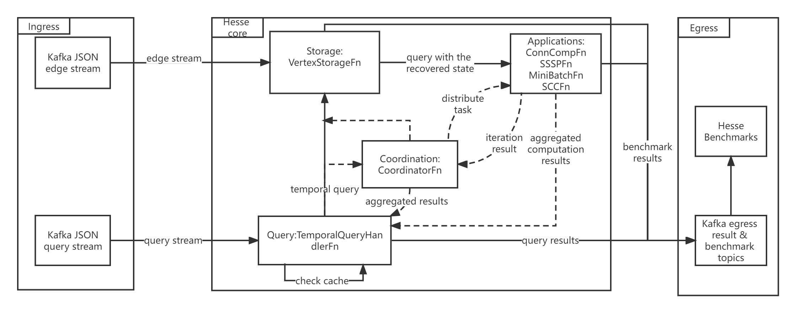

# hesse

A temporal graph library based on Flink Stateful Functions

## Already Done (v1.0)

- [x] Architecture design and Docker environment
- [x] Kafka Graph Ingress and Query Ingress Stream
- [x] Connected Component, Strongly Connected Component, MiniBatch algorithms based on Graph Traversal
- [x] A basic non-benchmarking storage paradigm using TreeMap with persistence
- [x] Query support for three algorithms on arbitrary time window
- [x] Query cache
- [x] Time calculation for query

## TODO

- [x] User-configurable Implementation of different storage paradigms
- [x] Performance benchmarking for different storage paradigms
- [x] Measurement of time for queries of three algorithms
- [x] add Logger and set logger level to eliminate effect of print statements on time measurement
- [x] Measurement of time for ingestion of edges
- [x] Break storage TreeMap buckets into different ValueSpecs and see the performances 
- [ ] Exploration on remote and local Statefun
- [ ] Support of Single-Source-Shortest-Path algorithm and PageRank (optional)
- [ ] Query Concurrency investigation on different concurrent applications
- [ ] LRU cache of query and vertex state
- [ ] Performance benchmarking comparing with other temporal graph engines

## Features

This project aims to build a highly scalable and efficient graph processing library on top of [Flink Statefun Functions](https://nightlies.apache.org/flink/flink-statefun-docs-stable/). It provides efficient storage of temporal graph and implement the query of graph state at any specific event time for different graph algorithms.

## Architecture

The architecture is basically divided into storage, query and application layers. As you can see they are corresponding to the three folders in the project source folder. Flink Stateful Functions guarantee that each Function serve as a service and the functions specified in this project have their own context and communicate with each other by message passing. Currently, the Kafka ingress and egress are used. The containers are built and run in Docker environment.

As Flink Statefun is native to FaaS (Function as a Service), users can easily make contribution to this library and add their own independent new applications or algorithms to this library. Functions can be remote or embedded with the consistency promise by Flink internals.

The basic architecture is shown as follows:



[comment]: <> (After redesigning in version 2.0 &#40;still in implementing&#41;, the new architecture will be as follows:)

[comment]: <> (![arch]&#40;doc/arch_hesse_new.png&#41;)

[comment]: <> (Regarding the hesse sql and its usage, please refer to [hesse sql]&#40;https://github.com/Spycsh/hesse-sql&#41;)

## How to use

There are different scenarios so far you can try out, I write a simple [script](./scenarios_config.py) to help you select the right scenario. For developers, you can write your own to replace `docker-compose.yml` and `module.yaml`.

```
python scenarios_config.py
```

build the environment and start the containers

```shell
docker-compose down
docker-compose build
docker-compose up
```

Currently, three algorithms are implemented for queries, Connected Component algorithm, Strongly Connected Component algorithm and MiniBatch algorithm. Make sure to select the right ingress file and type using `scenarios_config.py`.

To see the results of query, you can execute the following command:

```shell
docker-compose exec kafka kafka-console-consumer --bootstrap-server kafka:9092 --topic query-results --partition 0 --from-beginning --property print.key=true --property key.separator=" ** "
```

## Advanced Tips

These are still in experiments and tips for developers

* inspect the egress

```
docker-compose exec kafka kafka-console-consumer --bootstrap-server kafka:9092 --topic <replace topic name here> --from-beginning
```

* use partition manager:

Hesse allow two ways of storage of the graph: 
1) partition by vertex id (VertexStorageFn -> Applications)
2) partition by partition id (ControllerFn -> PartitionManagerFn -> Applications)

The former will create context for each vertex and rely on Flink internal partitioning scheme

The latter will offer a coarse granularity, where several nodes are classified to one partition,
and they share one context

This can also be configured in module.yaml with the ingress targets field

* delete corrupted topics

```shell
docker exec hesse_kafka_1 kafka-topics --list --zookeeper zookeeper:2181
docker exec hesse_kafka_1 kafka-topics --delete --zookeeper zookeeper:2181 --topic example-temporal-graph
```

* use curl to query
```shell
curl -X PUT -H "Content-Type: application/vnd.connected-components.types/vertex" -d '{"vertex_id": "1", "neighbours": ["2", "3"]}' localhost:8090/connected-components.fns/vertex/1
```