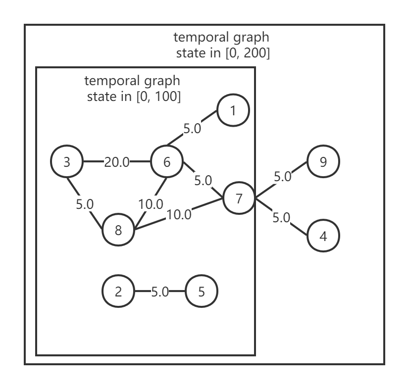

# Demo

In this demo, we will show you the usage of the project by giving a simple example.

## Prepare

1. **Specify the graph ingress**  
Here we use [demo_edges](https://github.com/Spycsh/hesse/blob/main/datasets/graph/demo_edges.txt) as our graph edges ingress. For explanation convenience, we form the graph as an undirected weighted temporal graph. Each edge has a weight on it. Each edge also has a timestamp on it representing the moment the edge is added.

2. **Specify the query egress**  
Here we use [demo_query](https://github.com/Spycsh/hesse/blob/main/datasets/query/demo_query.txt) as our query ingress. We have 10 queries on two time windows, [0,100] and [0,200]. To make it clear, the temporal graph states of these two windows are shown in the following image.
  
We have queries with different parameters, such as `vertex_id` (3 and 7) and `query_type` (connected-components, single-source-shortest-path, gnn-sampling, and pagerank). They will be concurrently handled by Hesse and the results will be fed into the egress topics and also persisted in the `benchmarks` folder.

The project already specifies the above two ingress data sets as default. If you want to try this demo, you do not need to consider this step. If you want to use your own ingress data sets, please configure them by following commands:
```
> cd hesse
> python scripts/scenarios_config.py
0       demo_edges.txt
1       <link_to_your_graph_dataset>.txt
select the graph edges ingress (enter the index) :
1


0       demo_query.txt
1       <link_to_your_query_dataset>.txt
select the query ingress (enter the index) :
1

how long in seconds would you delay the start of query producer:
20

...
Success initialize
```


## Run
```
cd hesse
docker-compose down
docker-compose build
docker-compose up
```
Check under `benchmarks` to see the results or use `docker-compose exec kafka kafka-console-consumer --bootstrap-server kafka:9092 --topic query-results --from-beginning` to see the results.

The results will contain records formed as the `query_id`, `user_id`, the query execution time, and the result string. An example is shown as follows:

```
8 1 755 'Result of query 8 by user 1: connected component id of node 7 is 1. All node ids that contain in the same component are:[1, 3, 4, 6, 7, 8, 9]'
```

It means that it needs 755 milliseconds for handling query 8 from user 1 and the result is that the connected component id of node 7 is 1. All node ids that are contained in the same component are: [1, 3, 4, 6, 7, 8, 9].